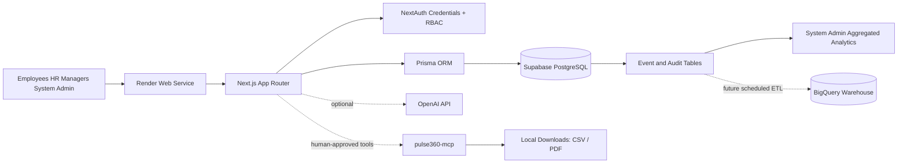
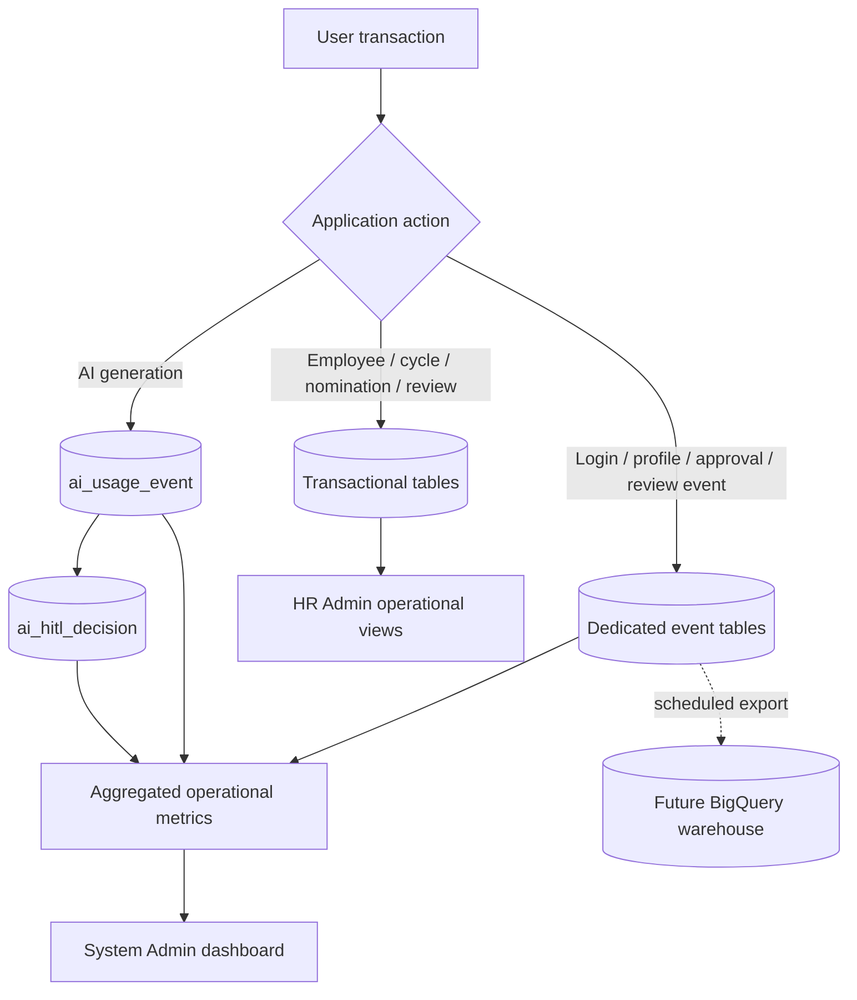
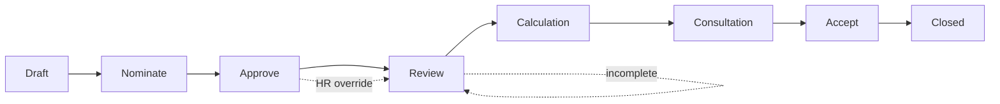

# Pulse360 Architecture and Non-Functional Requirements

## 1. Architecture Overview

Pulse360 is a TypeScript and Next.js full-stack application. The Next.js App Router provides the user interface, authenticated server-rendered pages, API route handlers, and integration points for Prisma, NextAuth, OpenAI, and the custom MCP server.



```text
Users
  |
  v
Render Web Service
  Next.js App Router + TypeScript
  NextAuth credentials authentication
  Role-based route and API authorization
  Prisma ORM + pg adapter
  |                  \
  |                   \-- OpenAI API (optional AI assistance)
  v
Supabase PostgreSQL
  Application tables
  Prisma migrations
  Audit and event projection tables

System Admin analytics
  Read-only, anonymized/aggregated operational metadata
  Derived from audit, auth, profile, nomination, review, AI, and HITL events

Future analytics warehouse
  Supabase event tables -> scheduled ETL -> BigQuery
```

The Mermaid diagram is the authoritative visual summary of the production path. The plain-text version remains for environments that do not render Mermaid.

## 1.1 Event and Analytics Flow



The System Admin view consumes aggregated operational metadata. Review comments and scores remain outside that dashboard.

## 2. Production Deployment Design

| Component | Production responsibility |
|---|---|
| Render Web Service | Hosts the live Pulse360 Next.js application at `https://pulse360-gkt8.onrender.com`. |
| Supabase PostgreSQL | Production source of truth for employees, departments, cycles, nominations, reviews, results, audit records, and event projections. |
| Prisma 7 | Defines the relational schema, generates the client, and applies migrations during service startup. |
| NextAuth.js | Provides credentials-based authentication and signed sessions using `NEXTAUTH_SECRET` and `NEXTAUTH_URL`. |
| OpenAI API | Optional AI assistance for comments, summaries, improvement plans, and reports. Stub responses remain available when no key is configured. |
| MCP server | Provides guarded CSV/report file-generation tools after explicit human approval. |
| GitHub Actions | Runs CI checks before protected-branch merges and Render deployments. |

Production database configuration uses:

- `DATABASE_URL`: Supabase pooled/session connection for normal application traffic.
- `DIRECT_URL`: Supabase direct or stable session connection for Prisma migrations and administrative tooling.
- Supabase is the active production database. The former Render PostgreSQL database was used for the migration source and is no longer the application runtime target.
- BigQuery is not in the transactional write path. It may be introduced later as an analytics warehouse fed from Supabase event tables.

## 3. Application Boundaries

### Web and API layer

Next.js owns the UI and server-side API routes. API handlers enforce role permissions on the server; UI visibility is not treated as a security boundary.

### Identity and access

The platform has four distinct roles:

- `SYSTEM_ADMIN`: monitors platform adoption, operational health, and anonymized behavioral analytics.
- `HR_ADMIN`: manages employees, departments, cycles, approvals, results, and HR-sensitive demographic reporting.
- `MANAGER`: approves team nominations and completes assigned reviews.
- `EMPLOYEE`: nominates peers and completes assigned reviews.

System Admin analytics must not expose review comments or review scores. HR Admin retains access to sensitive HR and performance information according to the application’s authorization rules.

### Data and event model

Transactional tables hold the current business state. Dedicated event tables hold purpose-specific operational metadata so audit analytics does not depend on one overloaded log table:

- `audit_log`: append-only governance events.
- `auth_event`: login success/failure and access metadata.
- `profile_event`: profile-change metadata without storing old/new sensitive values.
- `nomination_event`: nomination lifecycle and department snapshots.
- `review_event`: review draft/submission metadata without comments or scores.
- `ai_usage_event`: AI feature, status, model, and token metadata.
- `ai_hitl_decision`: accept/edit/discard decisions for AI-generated content.

The `employee` table also contains HR-managed workforce dimensions such as job grade, employment type, conversion-hire status, gender, and ethnicity. Gender may support aggregated platform adoption analysis; ethnicity is restricted to HR demographic reporting.

## 4. Local Development Design

Local development may use a PostgreSQL container through Podman and the SQL files in `database/init/`. This is a development convenience and is not the production database architecture.

```text
Local Next.js app -> local PostgreSQL/Podman
                    or a developer-approved Supabase development project
```

Never commit `.env`, database URLs, passwords, API keys, dump files, or generated HR reports. Use `.env.example` as the safe variable-name reference.

## 5. Review-Cycle Workflow

The core lifecycle is:

`Draft -> Nominate -> Approve -> Review -> Calculation -> Consultation -> Accept -> Closed`



Cycle transitions are controlled by HR Admin. Nomination approval is scoped to the responsible line manager, with HR override capability. Review assignment is derived from approved nominations, mandatory manager relationships, and the active cycle rules.

## 6. Non-Functional Requirements

### Performance

- Cold start target: under one minute.
- Normal page/API response target: under one second where practical.
- AI-generated content target: under five seconds, subject to provider latency.
- Database queries should use indexed foreign keys, cycle filters, role scope, and pagination for large lists.

### Reliability and recovery

- Prisma migrations must be committed to `pulse360/prisma/migrations` and applied with `prisma migrate deploy`.
- Production database backups and restore verification must be documented in `BUG_AUDIT.md` and `RENDER_TO_SUPABASE_MIGRATION.md`.
- A deployment is not considered complete until the service starts, `/api/health` responds, and representative reads/writes succeed.
- Database deletion or migration reset requires explicit confirmation and a verified backup.

### Security and privacy

- No secrets or full connection strings in source control or documentation.
- Server-side RBAC is required for every protected API route.
- Passwords are stored as bcrypt hashes.
- System Admin analytics use aggregated/anonymized metadata and exclude review comments and scores.
- Audit records should capture who performed an operational action, when it occurred, the target resource, and the result without unnecessarily duplicating sensitive content.

### Maintainability

- TypeScript type checking and CI checks run before protected-branch merges.
- Database changes require a Prisma migration and a focused verification query or test.
- Architecture and deployment changes must be reflected in the README and the project audit trail.
